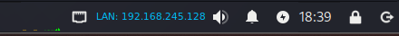
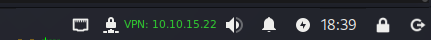

# 🖥 XFCE Genmon – VPN/LAN IP Monitor (Kali Linux)

## 📌 Problem
After updating to `xfce4-genmon-plugin 4.3.0`, the old `.rc` configuration files stopped working.  
The panel appeared empty (`<txt></txt>`) when no VPN was present, breaking the workflow and leaving no clear network status.


👉 I created a custom wrapper script (with some help and adaptation) to fix the Genmon VPN/LAN status issue after the 4.3.0 update. 
The goal was to ensure consistent panel output, with colors, tooltips, and click-to-copy functionality.

---

## ✅ Solution
This project provides a wrapper script `vpnip-genmon.sh` that ensures consistent and clean Genmon XML output:

- Shows **LAN IP (blue)** when no VPN is active.
- Shows **VPN IP (green + VPN icon)** when connected.
- Tooltip displays all interfaces with assigned IPs (IPv4).
- Click-to-copy VPN IP (requires `xclip` or `wl-clipboard`).
- Works across XFCE panel updates (post–4.3.0).

---

## 🔧 Installation

### 1. Copy script
```bash
sudo cp vpnip-genmon.sh /usr/local/bin/
sudo chmod +x /usr/local/bin/vpnip-genmon.sh
```
### 2. Configure Genmon plugin (CLI)
Replace `plugin-15` with your actual plugin ID:
```bash
xfconf-query -c xfce4-panel -p /plugins/plugin-15/command -t string -s "/usr/local/bin/vpnip-genmon.sh"
xfconf-query -c xfce4-panel -p /plugins/plugin-15/use-label -t bool -s true
xfconf-query -c xfce4-panel -p /plugins/plugin-15/enable-markup -t bool -s true
xfconf-query -c xfce4-panel -p /plugins/plugin-15/update-period -t int -s 5000
```
### 3. Restart the panel
```bash
xfce4-panel -r
```
## XFCE Panel Configuration (GUI way)
If you prefer the graphical method:
1. Right-click on XFCE panel → Panel → Add New Items.
2. Add Generic Monitor (Genmon).
3. Right-click → Properties.
4. Set the command:
```bash
/usr/local/bin/vpnip-genmon.sh
```
- Period (s): 5
- Enable "Use Label"
- Enable "Markup (Pango markup allowed)"
5. Restart panel if needed:
```bash
xfce4-panel -r
```
## 🎯 Result
With the script in place, the panel always displays the correct status:

🟦 **LAN: 192.168.x.x** (blue) when no VPN



🟩 **VPN: 10.10.x.x** (green + VPN icon)



**Tooltip:** shows interfaces and all IPs

**VPN mode:** click text → copies VPN IP to clipboard
